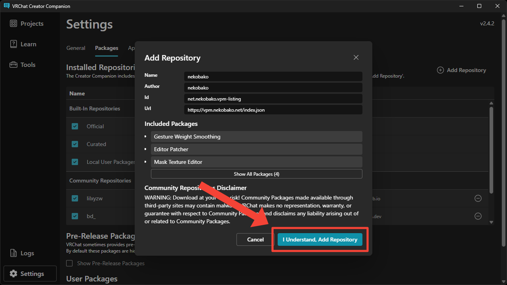
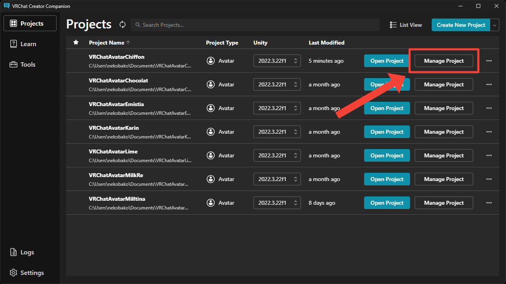
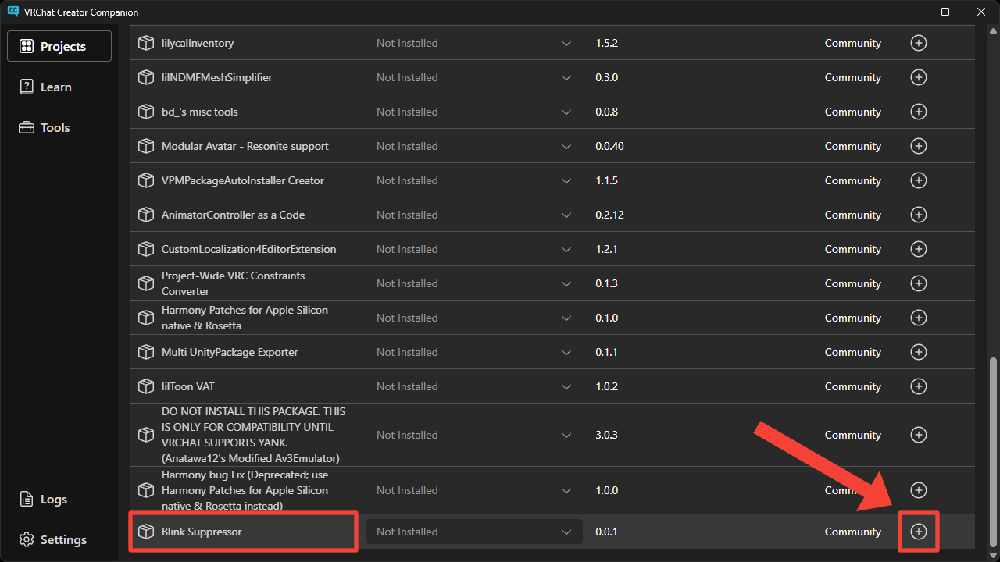

# Installation
1. Open VCC from [this link](vcc://vpm/addRepo?url=https://vpm.nekobako.net/index.json) and add the repository.

2. Press `Manage Project` button at your project.

3. Press `+` button at the right of `Blend Shape Modifier` package.

