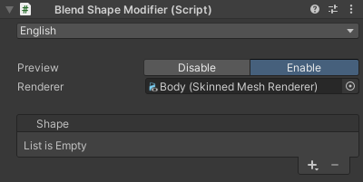

# `Blend Shape Modifier` Component
The only component in this tool.  
Here, you can set the target renderer and add or remove shapes.

You can also toggle the real-time preview.  
Because the current preview process is performance-heavy, it is recommended to enable it only when checking the blend shapes you have created.

| Item | Description |
| --- | --- |
| Language | Selects the UI language. |
| Preview | Toggles the real-time preview. |
| Renderer | Sets the target renderer. |
| Shapes | Adds or removes shapes. For details, refer to the [Shape](./shape). |
