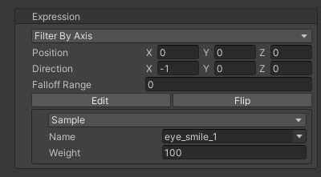
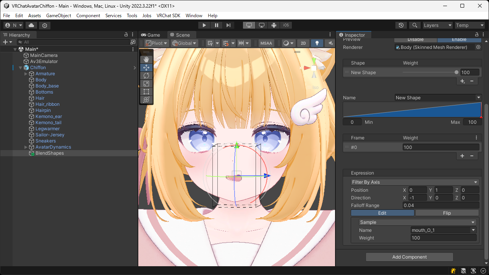

# `Filter By Axis` Expression
An expression that filters another expression using position and direction.  
By setting a falloff range, you can smoothly attenuate the influence near the boundary.

| Item | Description |
| --- | --- |
| Position | Sets the position used for filtering. |
| Direction | Sets the direction used for filtering. |
| Falloff Range | Sets the distance over which the influence near the boundary is attenuated. |
| Expression | Sets the expression to be filtered. |

> [!TIP]
> By pressing the `Edit` button, you can adjust the position and direction directly in the Scene View.

