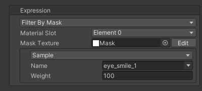
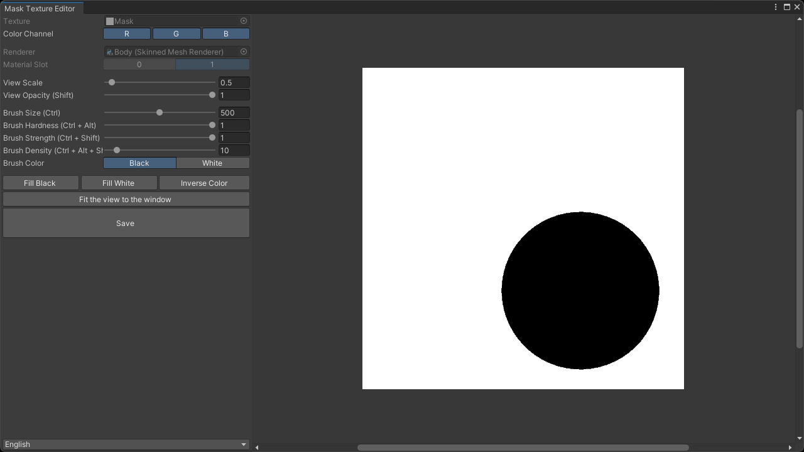

# `Filter By Mask` Expression
An expression that filters another expression using a mask texture.  
By applying a gradient to the mask texture, you can smoothly attenuate the influence near the boundary.

| Item | Description |
| --- | --- |
| Material Slot | Sets the material slot used for filtering. |
| Mask Texture | Sets the mask texture used for filtering. |
| Expression | Sets the expression to be filtered. |

> [!TIP]
> By installing the [Mask Texture Editor](https://github.com/nekobako/MaskTextureEditor), you can create and edit mask textures directly in the Unity Editor.

