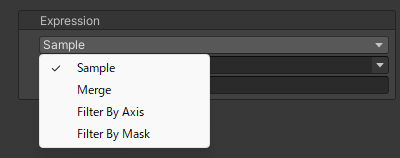

# Expressions
Definitions of deformations expressed by blend shapes.  
Here, you can create new expressions using existing blend shapes or other expressions.

| Item | Description |
| --- | --- |
| Sample | Samples an existing blend shape. For details, refer to the [Sample Expression](./sample-expression). |
| Merge | Merges multiple expressions. For details, refer to the [Merge Expression](./merge-expression). |
| Filter By Axis | Filters another expression using position and direction. For details, refer to the [Filter By Axis Expression](./filter-by-axis-expression). |
| Filter By Mask | Filters another expression using a mask texture. For details, refer to the [Filter By Mask Expression](./filter-by-mask-expression). |
