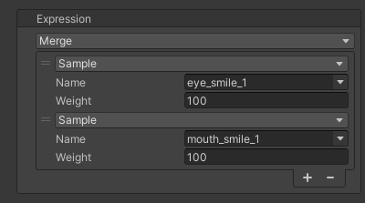

# `Merge` Expression
An expression that merges multiple expressions.  
You can set any number and type of expressions as merge targets.

| Item | Description |
| --- | --- |
| Expressions | Adds or removes expressions to be merged. |
