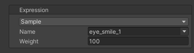

# `Sample` Expression
An expression that samples an existing blend shape at a specified weight.  
By setting weights outside the 0–100 range, you can express deformations that goes beyond its limits.

| Item | Description |
| --- | --- |
| Name | Sets the name of the blend shape to sample. |
| Weight | Sets the weight of the blend shape to sample. |
