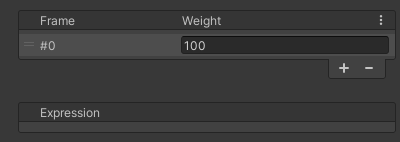

# Frame
Definition of a blend shape frame.  
Here, you can set the frame's weight and expression.

| Item | Description |
| --- | --- |
| Weight | Sets the weight of the frame. |
| Expression | Sets the expression. For details, refer to the [Expressions](./expressions/). |
