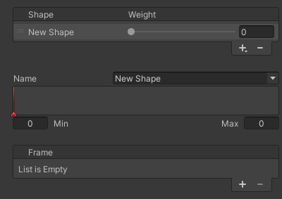

# Shape
Definition of a blend shape.  
Here, you can set the blend shape's name and weight, and add or remove frames.

| Item | Description |
| --- | --- |
| Name | Sets the name of the blend shape. If a blend shape with the same name already exists, it will be overwritten. |
| Weight | Sets the weight of the blend shape. This setting can be animated. |
| Min | Sets the minimum weight. This can only be changed if the first frame's weight is less than 0. |
| Max | Sets the maximum weight. This can only be changed if the last frame's weight is greater than 0. |
| Frames | Adds or removes frames. For details, refer to the [Frame](./frame). |
