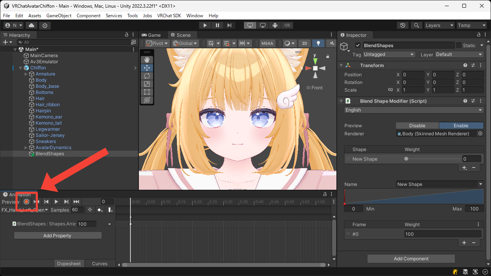

# Animations
This page explains how to animate the blend shapes created with this tool.

1. Assign an Animator Controller to your avatar and open the Animation Window.

2. Select the Game Object that has the `Blend Shape Modifier` component attached.

3. Start recording the animation.

4. Change the `Weight` value of the blend shape you want to animate.  
Switching `Preview` to `Enable` makes it easier to see the actual movement.

5. Stop recording the animation.

6. Use [Gesture Manager](https://github.com/BlackStartx/VRC-Gesture-Manager) or [Av3 Emulator](https://github.com/lyuma/Av3Emulator) to confirm that the animation works as expected.
