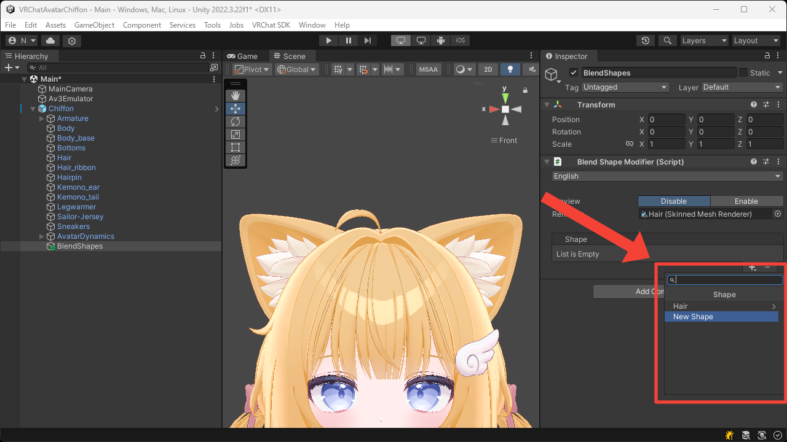
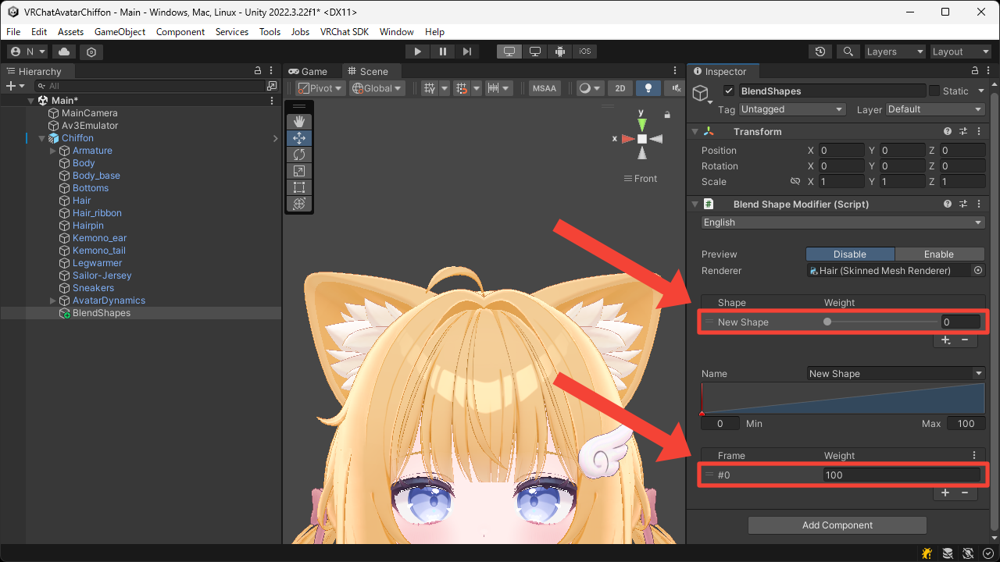
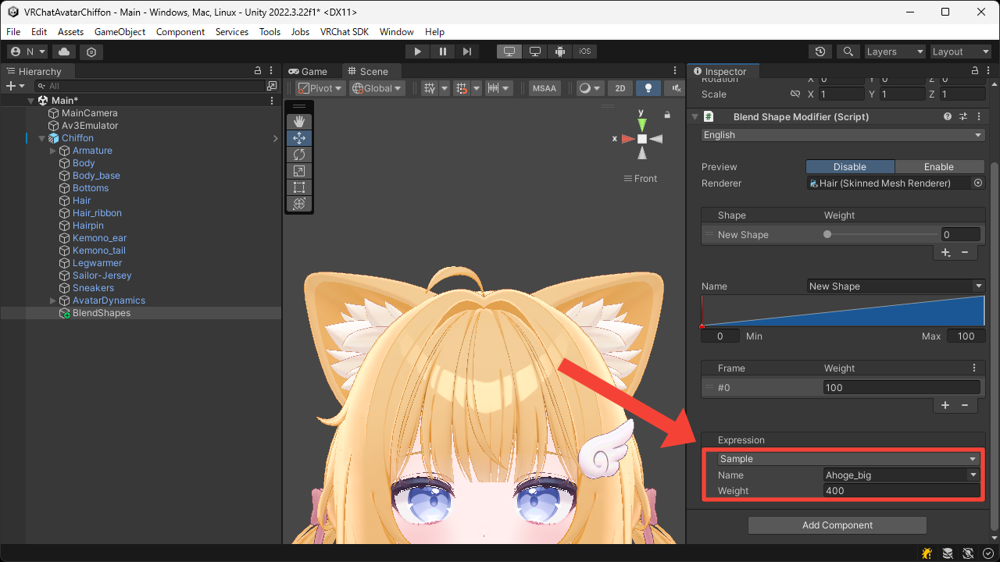
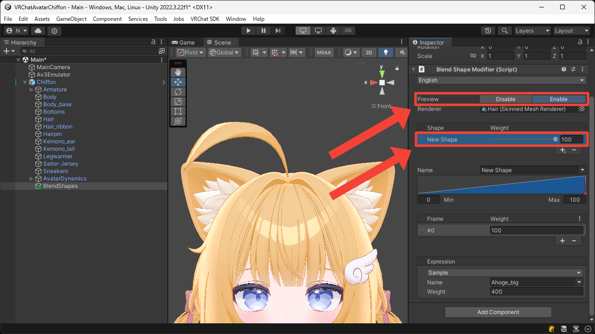

# Beyond Limits
This page explains how to create a new blend shape that goes beyond the limits of an existing one.

1. Press the `+` button to add `New Shape`.

2. Select the added shape and its frame.

3. In the `Sample` expression, set the `Name` to the blend shape whose limit you want to exceed, and set the `Weight` to a value outside the 0–100 range.  
In this example, we want to make the hair tuft much larger, so we set `Name` to `Ahoge_big` and `Weight` to `400`.

4. Switch `Preview` to `Enable` and set the `Weight` of the `New Shape` to `100`.  
You can now see that the hair tuft has become much larger.

