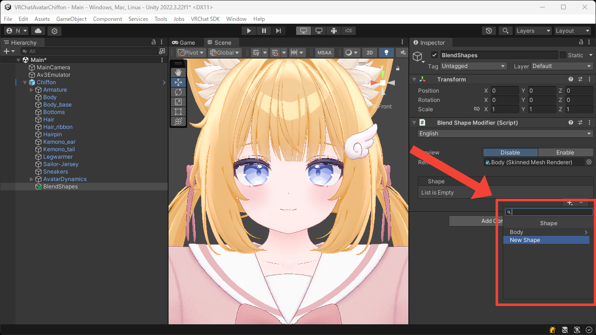
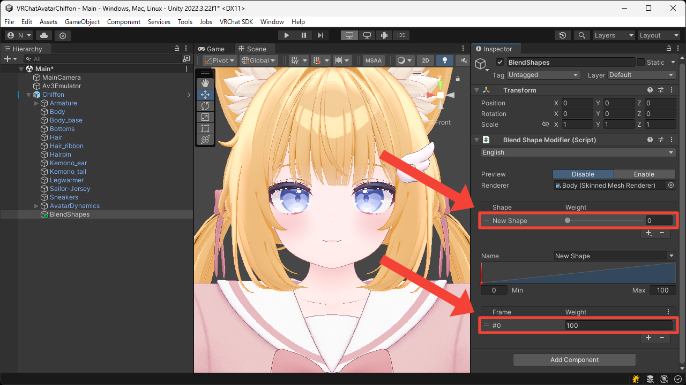
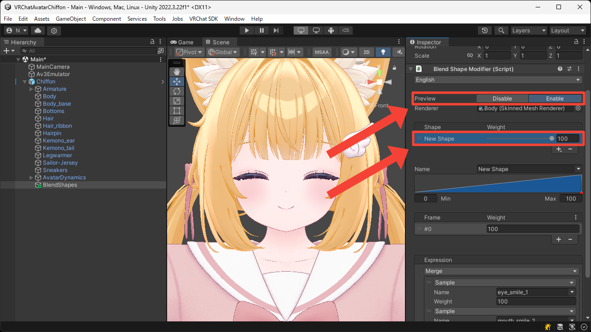
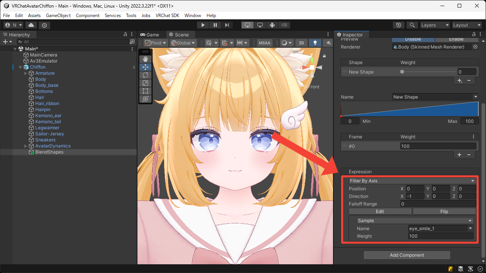
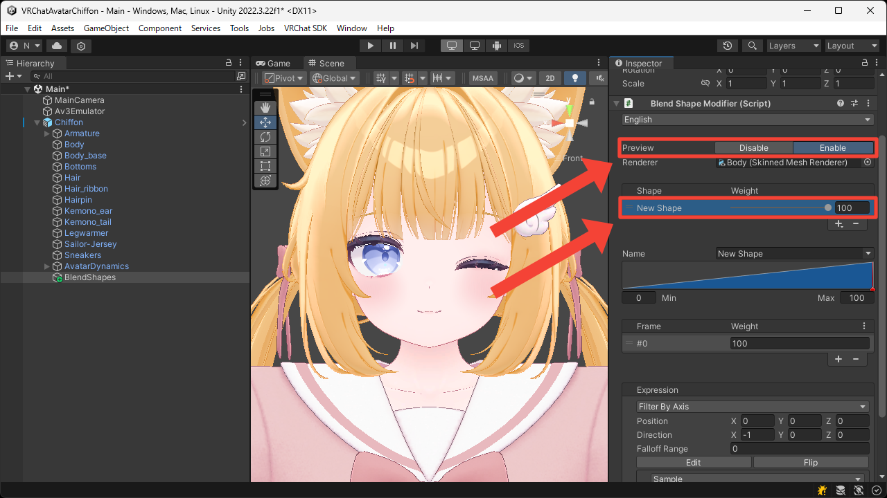
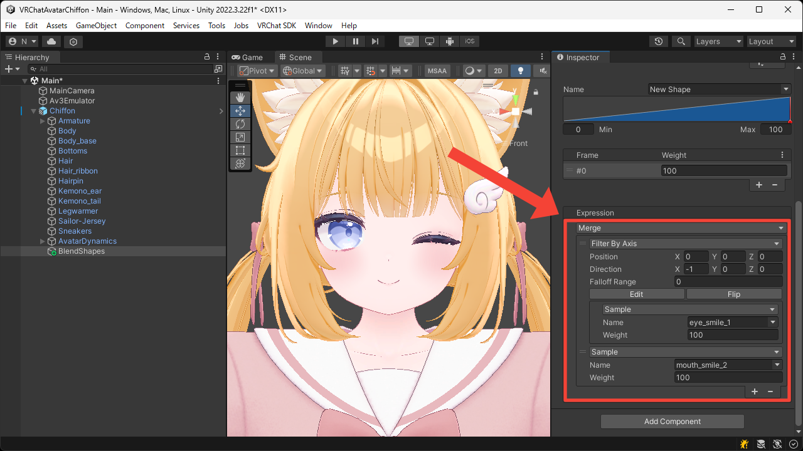

# Merge and Filter
This page explains how to create a new blend shape by merging or filtering existing blend shapes.

## Merging
1. Press the `+` button to add `New Shape`.

2. Select the added shape and its frame.

3. Switch the `Sample` expression to a `Merge` expression, and set the expressions to be merged.  
In this example, we want to merge the blend shapes that make the eyes and mouth smile, so we set the `Name` of the target `Sample` expressions to `eye_smile_1` and `mouth_smile_2`.

4. Switch `Preview` to `Enable` and set the `Weight` of the `New Shape` to `100`.  
You can now see that both the eyes and mouth are smiling.

## Filtering
1. Press the `+` button to add `New Shape`.

2. Select the added shape and its frame.

3. Switch the `Sample` expression to a `Filter By Axis` expression, and set the expression to be filtered.  
In this example, we want to filter the blend shape that closes both eyes, so we set the `Name` of the target `Sample` expression to `eye_smile_1`.

4. Switch `Preview` to `Enable` and set the `Weight` of the `New Shape` to `100`.  
You can now see that only one eye is closed.

## Combination
Expressions can be freely combined by nesting them.  
For example, by filtering the blend shape that closes both eyes so that only one eye closes, and then merging it with the blend shape that makes the mouth smile, you can create a new blend shape that smiles while winking.

