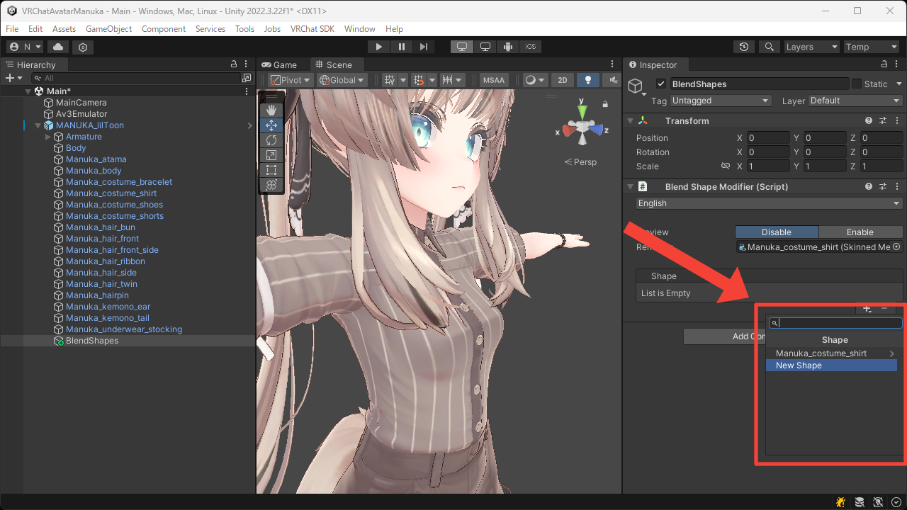
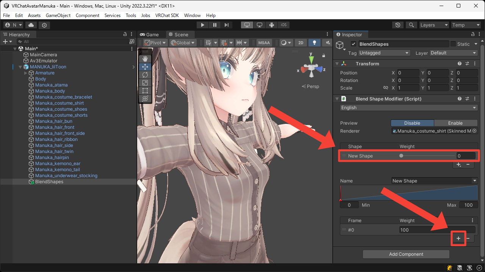
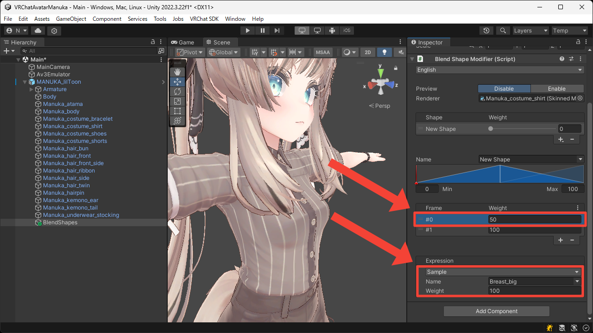
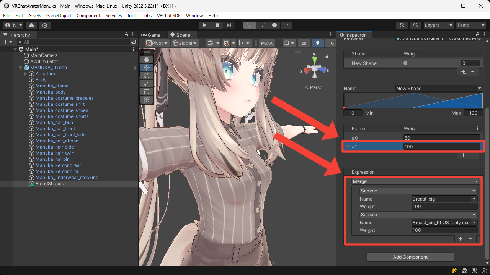

# Multi-Frames
This page explains how to insert multiple intermediate frames into a single blend shape.

1. Press the `+` button to add `New Shape`.

2. Select the added shape, then press the `+` button under the frame list to add a new frame.

3. Select the first frame and set up the expression.  
In this example, we want to maximize one of the blend shapes that changes the breast size in two stages, so we set the `Name` of the `Sample` expression to `Breast_big`.

4. Select the second frame and set up the expression.  
In this example, we want to maximize both of the blend shapes that changes the breast size in two stages, so we switch the `Sample` expression to `Merge` expression and set the `Name` of the target `Sample` expressions to `Breast_big` and `Breast_big_PLUS`.

5. Switch `Preview` to `Enable` and change the `Weight` of the `New Shape` from `0` to `100`.  
You can now see that the breasts move differently between the 0–50 range and the 50–100 range.

<video muted autoplay loop playsinline src="../videos/tutorials/multi-frames/multi-frames.mp4" />
