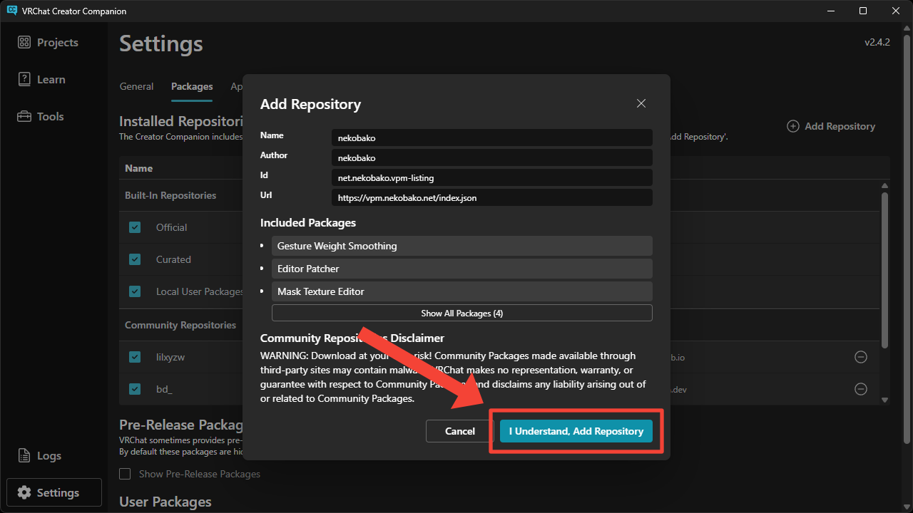
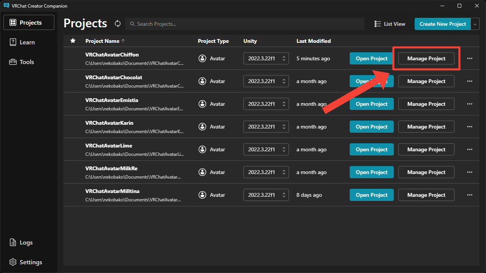
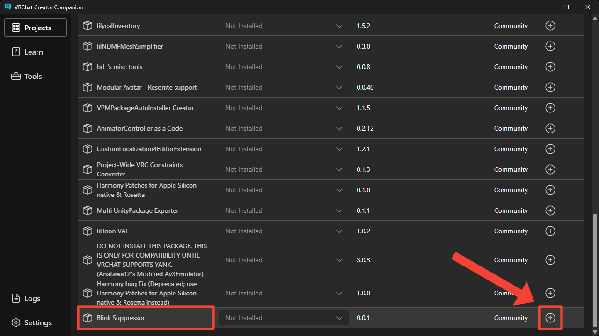

# インストール
1. [こちらのリンク](vcc://vpm/addRepo?url=https://vpm.nekobako.net/index.json) から VCC を開いてリポジトリを追加します。

2. プロジェクトの `Manage Project` ボタンを押します。

3. `Blend Shape Modifier` パッケージの右にある `+` ボタンを押します。

