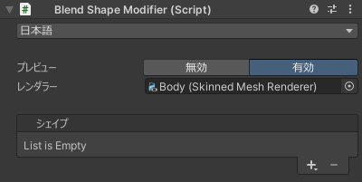

# `Blend Shape Modifier` コンポーネント
本ツール唯一のコンポーネントです。  
対象のレンダラーの設定とシェイプの追加/削除を行います。

リアルタイムプレビューの無効/有効もここで切り替えられます。  
現状のプレビューは処理が重いため、作成したブレンドシェイプを確認するときのみ有効にすることをおすすめします。

| 項目 | 説明 |
| --- | --- |
| 言語 | UI の言語を選択します。 |
| プレビュー | リアルタイムプレビューの無効/有効を切り替えます。 |
| レンダラー | 対象のレンダラーを設定します。 |
| シェイプ | シェイプを追加/削除します。詳しくは [シェイプ](./shape) を参照してください。 |
