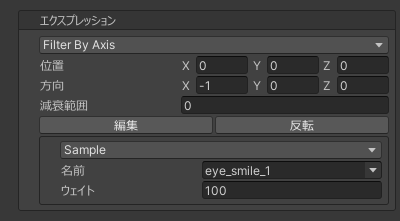
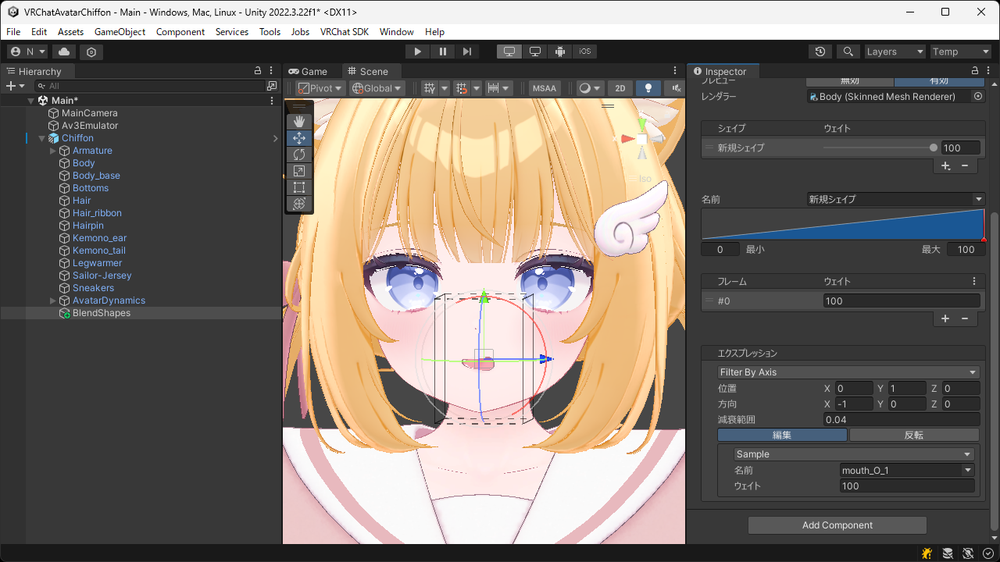

# `Filter By Axis` エクスプレッション
位置と方向を使用して別のエクスプレッションを分割するエクスプレッションです。  
減衰範囲を設定することで、境界部分の影響を滑らかに減衰させることができます。

| 項目 | 説明 |
| --- | --- |
| 位置 | 分割に使用する位置を設定します。 |
| 方向 | 分割に使用する方向を設定します。 |
| 減衰範囲 | 境界部分の影響を減衰させる距離を設定します。 |
| エクスプレッション | 分割するエクスプレッションを設定します。 |

> [!TIP]
> `編集` ボタンを押すとシーンビュー上で位置と方向を直接調整できます。

