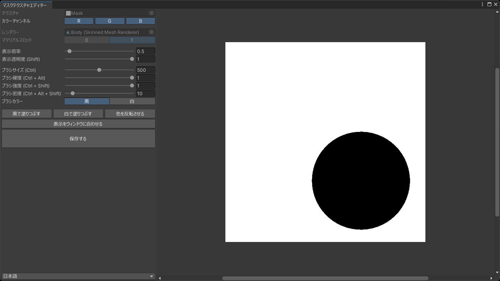

# `Filter By Mask` エクスプレッション
マスクテクスチャーを使用して別のエクスプレッションを分割するエクスプレッションです。  
マスクテクスチャーにグラデーションを付けることで、境界部分の影響を滑らかに減衰させることができます。

| 項目 | 説明 |
| --- | --- |
| マテリアルスロット | 分割に使用するマテリアルスロットを設定します。 |
| マスクテクスチャー | 分割に使用するマスクテクスチャーを設定します。 |
| エクスプレッション | 分割するエクスプレッションを設定します。 |

> [!TIP]
> [マスクテクスチャエディター](https://github.com/nekobako/MaskTextureEditor) をインストールすると Unity エディター上でマスクテクスチャーを直接作成/編集できます。

