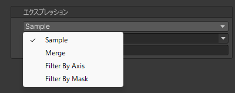

# エクスプレッション
ブレンドシェイプによって表現される変形の定義です。  
既存のブレンドシェイプや別のエクスプレッションを使用して新たな表現を作り出します。

| 項目 | 説明 |
| --- | --- |
| Sample | 既存のブレンドシェイプをサンプリングします。詳しくは [Sample エクスプレッション](./sample-expression) を参照してください。 |
| Merge | 複数のエクスプレッションを合成します。詳しくは [Merge エクスプレッション](./merge-expression) を参照してください。 |
| Filter By Axis | 位置と方向を使用して別のエクスプレッションを分割します。詳しくは [Filter By Axis エクスプレッション](./filter-by-axis-expression) を参照してください。 |
| Filter By Mask | マスクテクスチャーを使用して別のエクスプレッションを分割します。詳しくは [Filter By Mask エクスプレッション](./filter-by-mask-expression) を参照してください。 |
