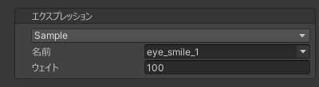

# `Sample` エクスプレッション
既存のブレンドシェイプを特定のウェイトでサンプリングするエクスプレッションです。  
0–100 の範囲外のウェイトを設定することで、限界突破した変形も表現できます。

| 項目 | 説明 |
| --- | --- |
| 名前 | サンプリングするブレンドシェイプの名前を設定します。 |
| ウェイト | サンプリングするブレンドシェイプのウェイトを設定します。 |
