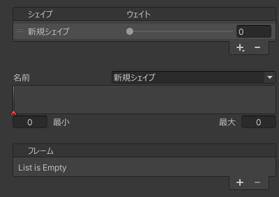

# シェイプ
ブレンドシェイプの定義です。  
ブレンドシェイプの名前とウェイトの設定、およびフレームの追加/削除を行います。

| 項目 | 説明 |
| --- | --- |
| 名前 | ブレンドシェイプの名前を設定します。同名のブレンドシェイプがある場合は上書きします。 |
| ウェイト | ブレンドシェイプのウェイトを設定します。この設定はアニメーション可能です。 |
| 最小 | ウェイトの最小値を変更します。最初のフレームのウェイトが 0 より小さいときのみ変更できます。 |
| 最大 | ウェイトの最大値を変更します。最後のフレームのウェイトが 0 より大きいときのみ変更できます。 |
| フレーム | フレームを追加/削除します。詳しくは [フレーム](./frame) を参照してください。 |
