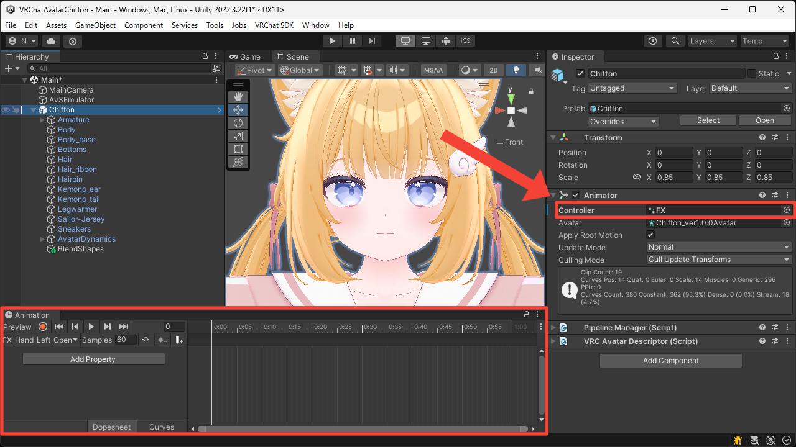
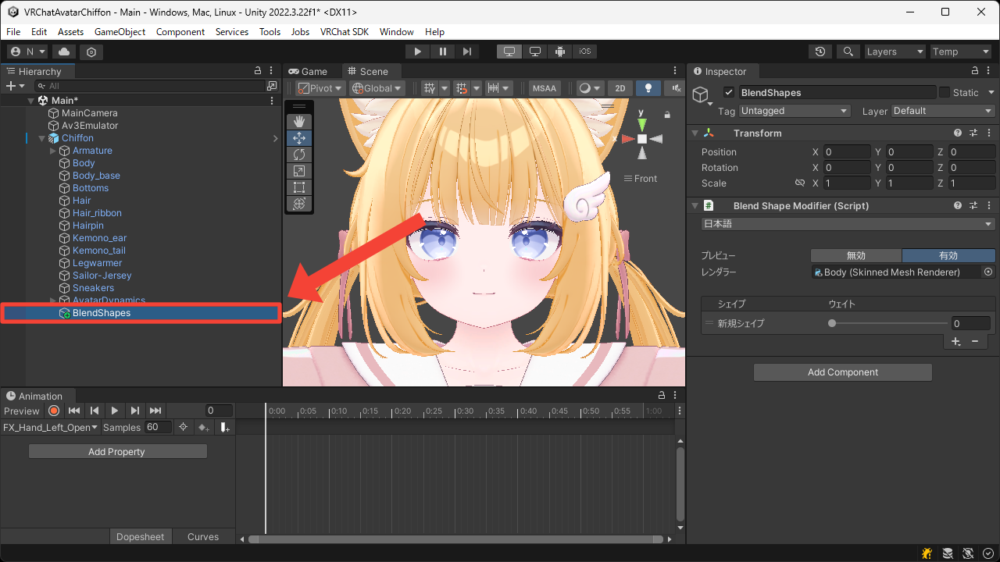
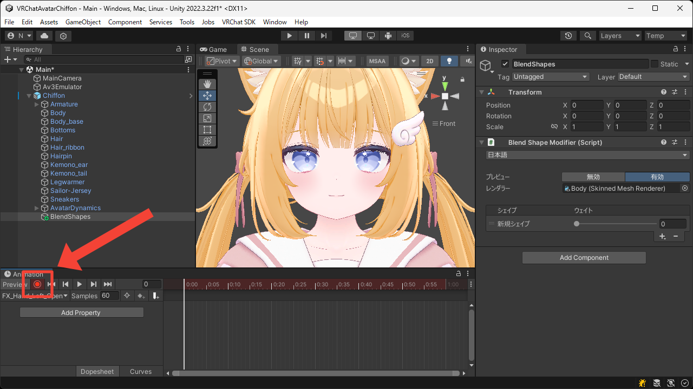
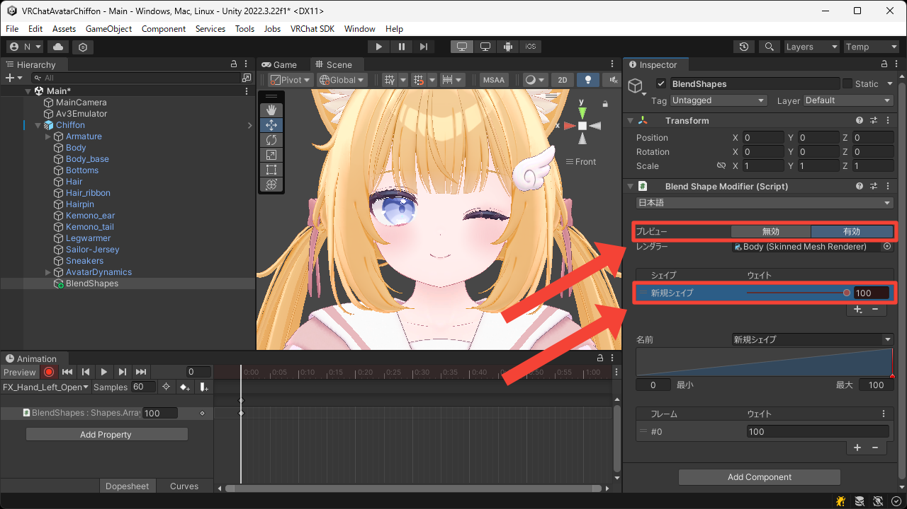
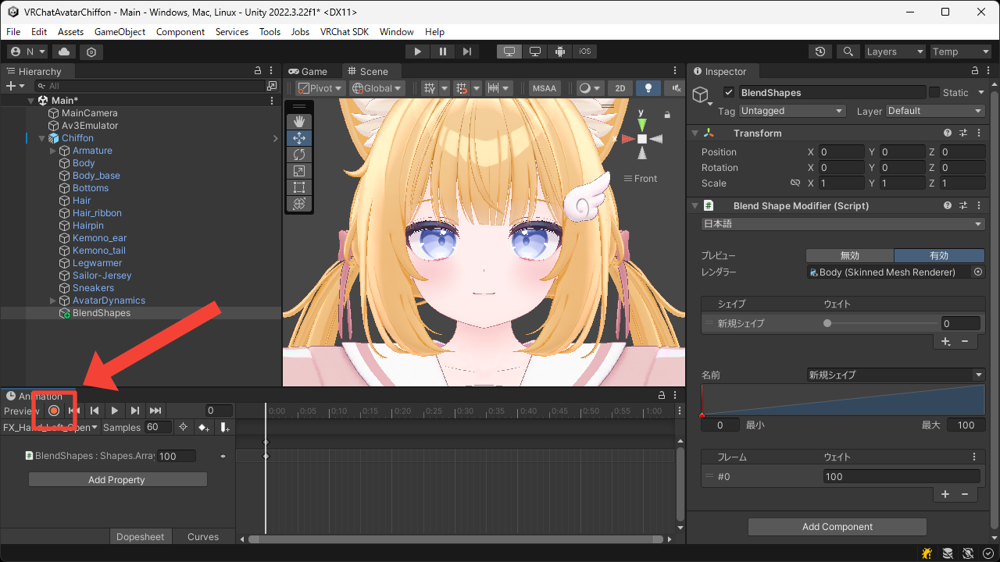

# アニメーション
このページでは本ツールで作成したブレンドシェイプをアニメーションで操作する方法について説明します。

1. アバターに Animator Controller を設定し、Animation ウィンドウを開きます。

2. `Blend Shape Modifier` コンポーネントを追加した Game Object を選択します。

3. アニメーションの録画を開始します。

4. アニメーションで操作したいブレンドシェイプの `ウェイト` の値を変更します。  
このとき `プレビュー` を `有効` にしておくと実際の動きが分かりやすいです。

5. アニメーションの録画を終了します。

6. [Gesture Manager](https://github.com/BlackStartx/VRC-Gesture-Manager) や [Av3 Emulator](https://github.com/lyuma/Av3Emulator) を使用してアニメーションが正しく動作することを確認します。
