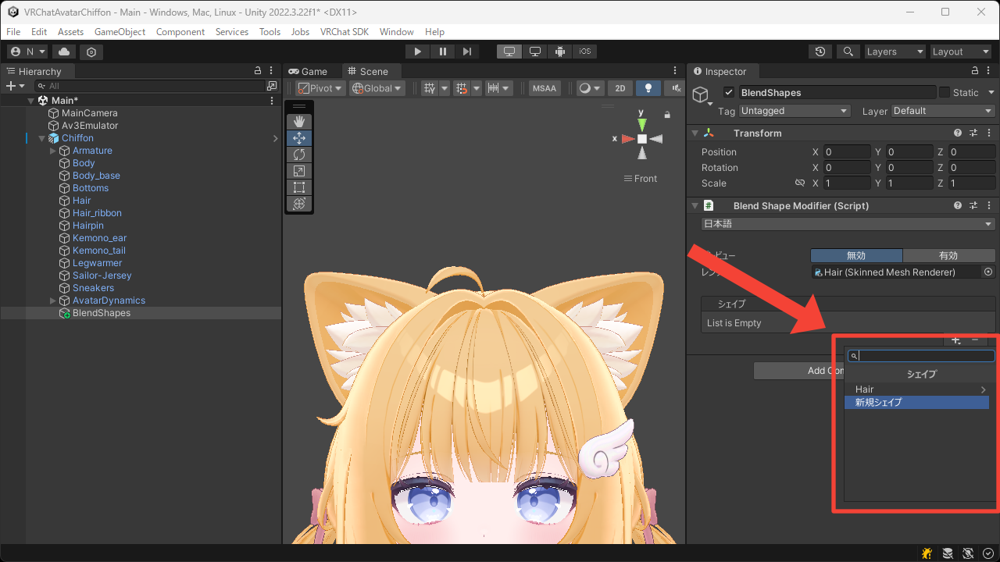
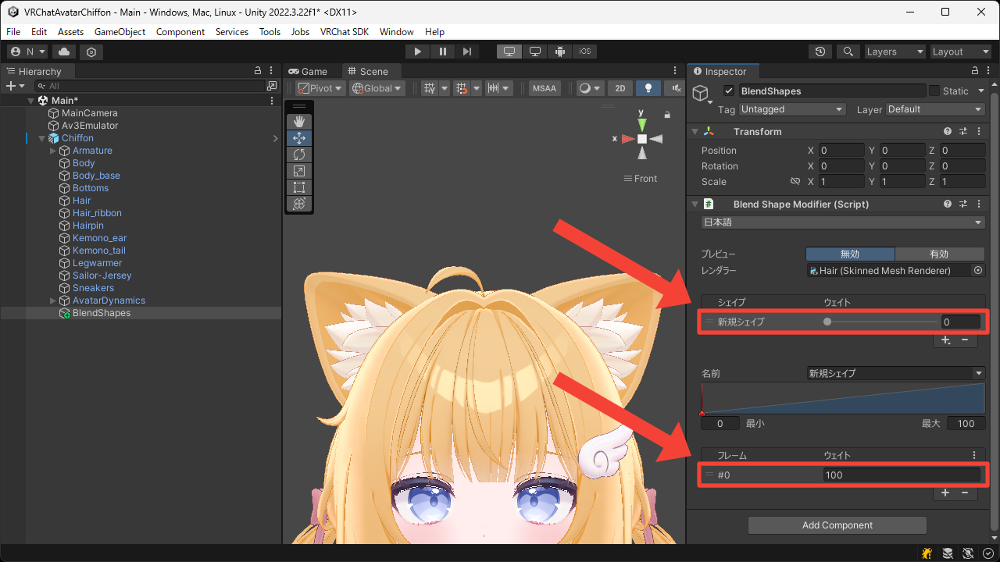
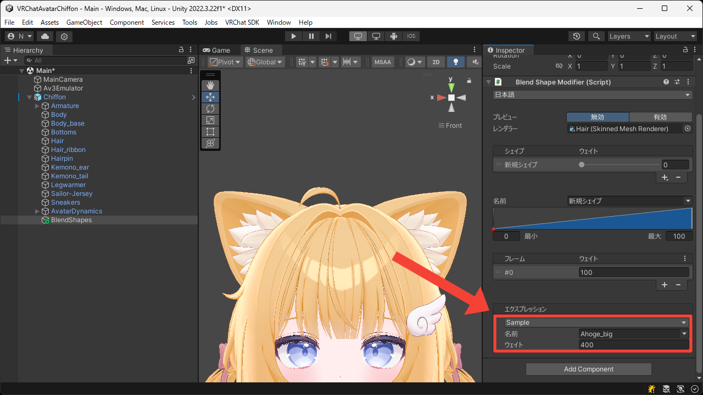
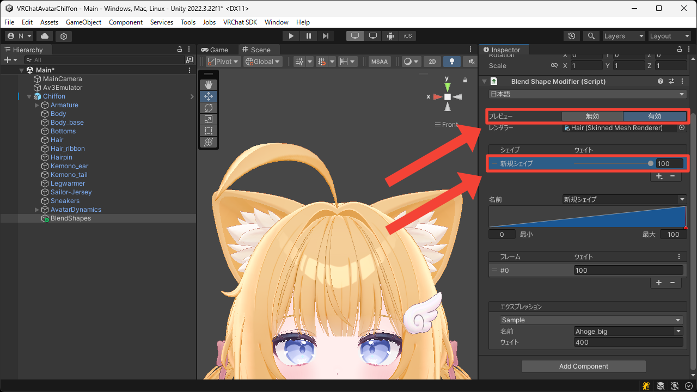

# 限界突破
このページでは既存のブレンドシェイプを限界突破して新しいブレンドシェイプを作成する方法について説明します。

1. `+` ボタンを押して `新規シェイプ` を追加します。

2. 追加されたシェイプとフレームを選択します。

3. `Sample` エクスプレッションの `名前` に限界突破したいブレンドシェイプの名前を、`ウェイト` に 0–100 の範囲外の値を設定します。  
今回はアホ毛をとても大きくしたいので、`名前` に `Ahoge_big` を、`ウェイト` に `400` を設定しています。

4. `プレビュー` を `有効` にして `新規シェイプ` の `ウェイト` を `100` にします。  
アホ毛がとても大きくなることが確認できました。

