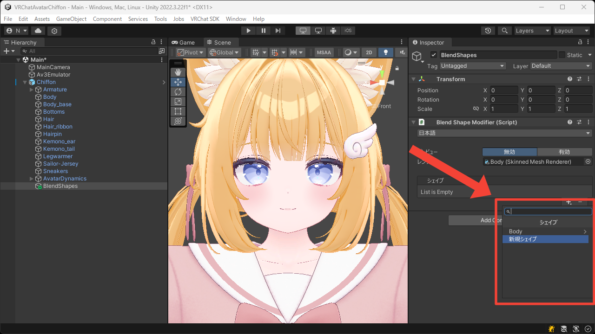
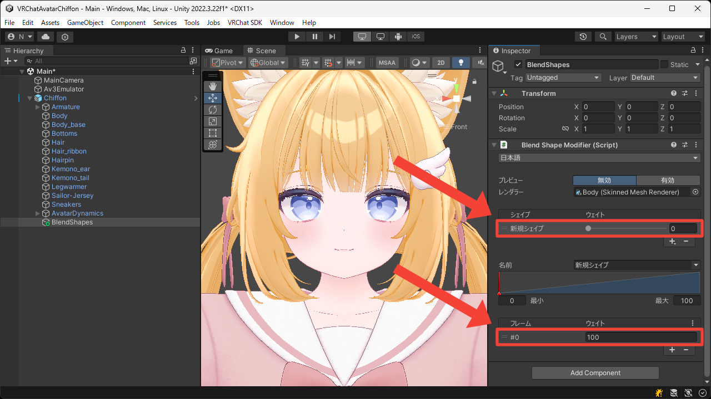
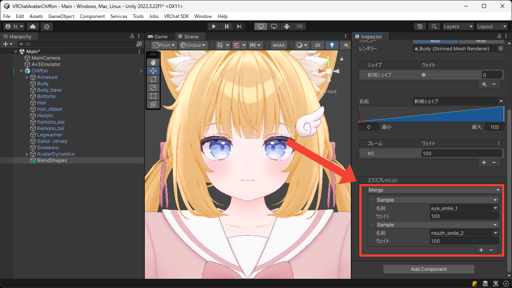
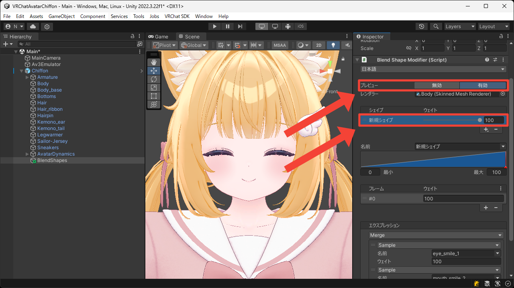
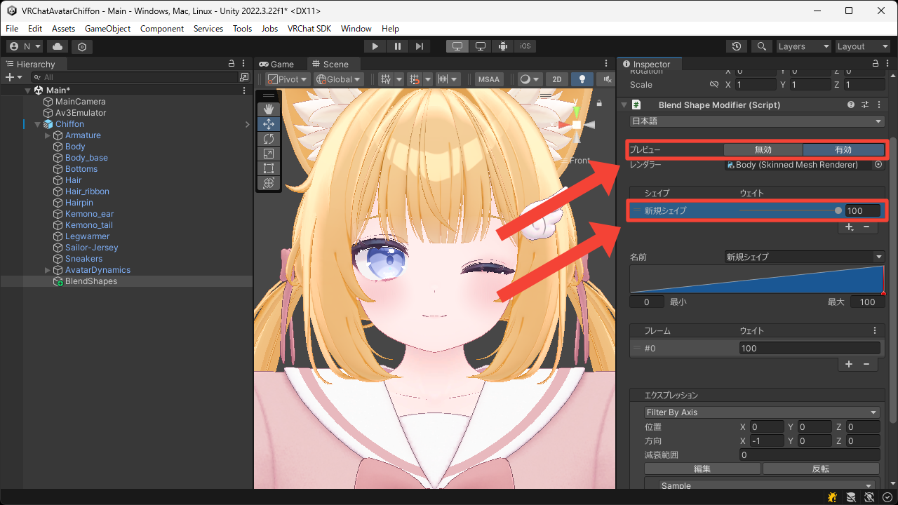
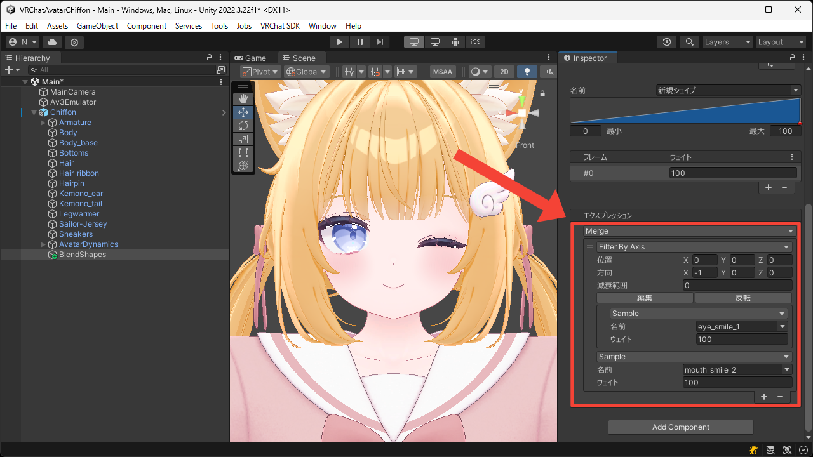

# 合成/分割
このページでは既存のブレンドシェイプを合成/分割して新しいブレンドシェイプを作成する方法について説明します。

## 合成
1. `+` ボタンを押して `新規シェイプ` を追加します。

2. 追加されたシェイプとフレームを選択します。

3. `Sample` エクスプレッションを `Merge` エクスプレッションに切り替え、合成対象のエクスプレッションを設定します。  
今回は目と口を笑顔にするブレンドシェイプを合成したいので、対象の `Sample` エクスプレッションの `名前` に `eye_smile_1` と `mouth_smile_2` を設定します。

4. `プレビュー` を `有効` にして `新規シェイプ` の `ウェイト` を `100` にします。  
目と口が同時に笑顔になることが確認できました。

## 分割
1. `+` ボタンを押して `新規シェイプ` を追加します。

2. 追加されたシェイプとフレームを選択します。

3. `Sample` エクスプレッションを `Filter By Axis` エクスプレッションに切り替え、分割対象のエクスプレッションを設定します。  
今回は両目を閉じるブレンドシェイプを分割したいので、対象の `Sample` エクスプレッションの `名前` に `eye_smile_1` を設定します。

4. `プレビュー` を `有効` にして `新規シェイプ` の `ウェイト` を `100` にします。  
片目だけが閉じることが確認できました。

## 組み合わせ
エクスプレッションは入れ子にして自由に組み合わせることができます。  
例えば、両目を閉じるブレンドシェイプを分割して片目だけが閉じるようにしたものと、口を笑顔にするブレンドシェイプを合成することで、ウィンクしながら笑顔になるブレンドシェイプを作り出すことができます。

