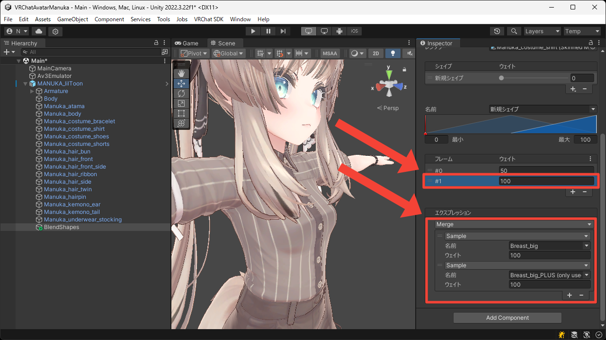

# マルチフレーム
このページでは 1 つのブレンドシェイプに複数の中間フレームを挿入する方法について説明します。

1. `+` ボタンを押して `新規シェイプ` を追加します。

2. 追加されたシェイプを選択し、フレーム一覧の下にある `+` ボタンを押してフレームを追加します。

3. 1 つ目のフレームを選択してエクスプレッションを設定します。  
今回は 2 段階に分けられた胸のサイズ変更のブレンドシェイプのうち一方を最大にしたいので、`Sample` エクスプレッションの `名前` に `Breast_big` を設定します。

4. 2 つ目のフレームを選択してエクスプレッションを設定します。  
今回は 2 段階に分けられた胸のサイズ変更のブレンドシェイプのうち両方を最大にしたいので、`Sample` エクスプレッションを `Merge` エクスプレッションに切り替え、対象の `Sample` エクスプレッションの `名前` に `Breast_big` と `Breast_big_PLUS` を設定します。

5. `プレビュー` を `有効` にして `新規シェイプ` の `ウェイト` を `0` から `100` まで変化させます。  
0–50 の範囲と 50–100 の範囲で胸の動き方が異なることが確認できました。

<video muted autoplay loop playsinline src="../videos/tutorials/multi-frames/multi-frames.mp4" />
